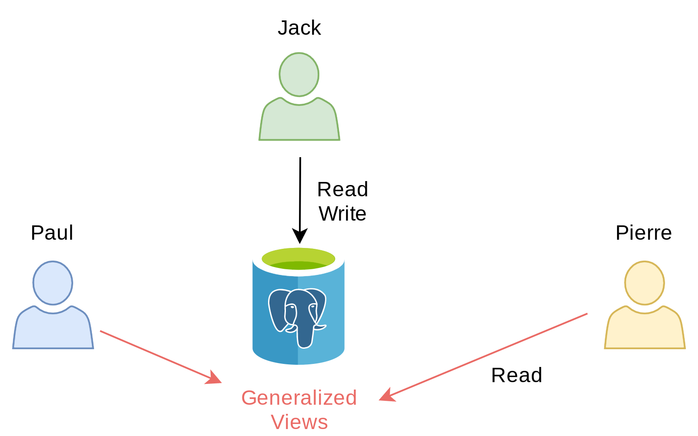

# 4 - Generalization

> The main idea of generalization is to \"blur\" the original data. For
> example, instead of saying \"Mister X was born on July 25, 1989\", we
> can say \"Mister X was born is the 80\'s\". The information is still
> true, but it is less precise and it can\'t be used to reidentify the
> subject.

## The Story

Paul hired dozens of employees over the years. He kept a record of their
hair color, size and medical condition.

Paul wants to extract weird stats from these details. He provides
generalized views to Pierre.

## How it works



## Learning Objective

In this section, we will learn:

-   The difference between masking and generalization
-   The concept of \"K-anonymity\"

## The \"employee\" table


``` { .run-postgres parse_query=False }
DROP TABLE IF EXISTS employee CASCADE;

CREATE TABLE employee (
  id INT PRIMARY KEY,
  full_name  TEXT,
  first_day DATE, last_day DATE,
  height INT,
  hair TEXT, eyes TEXT, size TEXT,
  asthma BOOLEAN,
  CHECK(hair = ANY(ARRAY['bald','blond','dark','red'])),
  CHECK(eyes = ANY(ARRAY['blue','green','brown'])) ,
  CHECK(size = ANY(ARRAY['S','M','L','XL','XXL']))
);
```

------------------------------------------------------------------------

::: caution

This is awkward and illegal.

:::

------------------------------------------------------------------------

Loading the data:

``` bash
curl -Ls https://dali.bo/employee -o /tmp/employee.tsv
head -n3 /tmp/employee.tsv
```

``` run-postgres
COPY employee FROM '/tmp/employee.tsv'
```

``` run-postgres
SELECT count(*) FROM employee;
```

``` run-postgres
SELECT full_name,first_day, hair, size, asthma
FROM employee
LIMIT 3;
```

## Data suppression

Paul wants to find if there\'s a correlation between asthma and the eyes
color.

He provides the following view to Pierre.

``` run-postgres
DROP MATERIALIZED VIEW IF EXISTS v_asthma_eyes;

CREATE MATERIALIZED VIEW v_asthma_eyes AS
SELECT eyes, asthma
FROM employee;
```

``` run-postgres
SELECT *
FROM v_asthma_eyes
LIMIT 3;
```

Pierre can now write queries over this view.

``` run-postgres
SELECT
  eyes,
  100*COUNT(1) FILTER (WHERE asthma) / COUNT(1) AS asthma_rate
FROM v_asthma_eyes
GROUP BY eyes;
```

Pierre just proved that asthma is caused by green eyes.

## K-Anonymity

The \'asthma\' and \'eyes\' are considered as indirect identifiers.

``` run-postgres
SECURITY LABEL FOR anon ON COLUMN v_asthma_eyes.eyes
IS 'INDIRECT IDENTIFIER';

SECURITY LABEL FOR anon ON COLUMN v_asthma_eyes.asthma
IS 'INDIRECT IDENTIFIER';
```

``` run-postgres
SELECT anon.k_anonymity('v_asthma_eyes');
```

The v_asthma_eyes has \'2-anonymity\'. This means that each
quasi-identifier combination (the \'eyes-asthma\' tuples) occurs in at
least 2 records for a dataset.

In other words, it means that each individual in the view cannot be
distinguished from at least 1 (k-1) other individual.

## Range and Generalization functions

``` run-postgres
DROP MATERIALIZED VIEW IF EXISTS v_staff_per_month;
CREATE MATERIALIZED VIEW v_staff_per_month AS
SELECT
    anon.generalize_daterange(first_day,'month') AS first_day,
    anon.generalize_daterange(last_day,'month') AS last_day
FROM employee;
```

``` run-postgres
SELECT *
FROM v_staff_per_month
LIMIT 3;
```

Pierre can write a query to find how many employees were hired in
november 2021.

``` run-postgres
SELECT COUNT(1)
       FILTER (
            WHERE make_date(2019,11,1)
            BETWEEN lower(first_day)
            AND COALESCE(upper(last_day),now())
       )
FROM v_staff_per_month;
```

### Declaring the indirect identifiers

Now let\'s check the k-anonymity of this view by declaring which columns
are indirect identifiers.

``` run-postgres
SECURITY LABEL FOR anon ON COLUMN v_staff_per_month.first_day
IS 'INDIRECT IDENTIFIER';

SECURITY LABEL FOR anon ON COLUMN v_staff_per_month.last_day
IS 'INDIRECT IDENTIFIER';

SELECT anon.k_anonymity('v_staff_per_month');
```

In this case, the k factor is 1 which means that at least one unique
individual can be identified directly by his/her first and last dates.

## Exercices

### E401 - Simplify `v_staff_per_month` and decrease granularity

Generalizing dates per month is not enough. Write another view called
\'v_staff_per_year\' that will generalize dates per year.

Also simplify the view by using a range of int to store the years
instead of a date range.

### E402 - Staff progression over the years

How many people worked for Paul for each year between 2018 and 2021?

### E403 - Reaching 2-anonymity for the `v_staff_per_year` view

What is the k-anonymity of 'v_staff_per_month_years'?

## Solutions

### S401

``` run-postgres
DROP MATERIALIZED VIEW IF EXISTS v_staff_per_year;

CREATE MATERIALIZED VIEW v_staff_per_year AS
SELECT
  int4range(
    extract(year from first_day)::INT,
    extract(year from last_day)::INT,
    '[]'
  ) AS period
FROM employee;
```

:::tip
'[]' will include the upper bound
:::

----

``` run-postgres
SELECT *
FROM v_staff_per_year
LIMIT 3;
```

### S402

``` run-postgres
SELECT
  year,
  COUNT(1) FILTER (
      WHERE year <@ period
  )
FROM
    generate_series(2018,2021) year,
    v_staff_per_year
GROUP BY year
ORDER BY year ASC;
```

### S403


``` run-postgres
SECURITY LABEL FOR anon ON COLUMN v_staff_per_year.period
IS 'INDIRECT IDENTIFIER';

SELECT anon.k_anonymity('v_staff_per_year');
```
